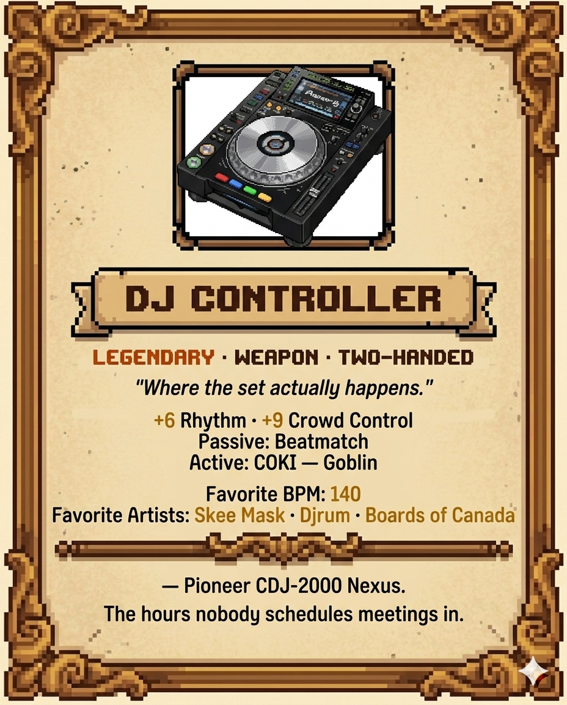

# RPG Character Carousel

A 10-slide LinkedIn document carousel that presents me as a classic 2D-RPG **character sheet** — a hero stats page, then one "item card" per hobby and tool, each graded by rarity like loot in an MMORPG.

It's a personal-branding piece, but the interesting part is underneath: it's a **prompt-engineering project**. The whole repo is a worked example of bending two generative-image models to a single, locked art direction and keeping them from drifting across ten separate renders.

<p align="center">
  
</p>

---

## The carousel

<table>
  <tr>
    <td></td>
    <td></td>
    <td></td>
  </tr>
  <tr>
    <td></td>
    <td></td>
    <td></td>
  </tr>
</table>

Each item is a real interest rendered as RPG loot: a DJ controller (`LEGENDARY · WEAPON`), a V60 coffee dripper (`UNCOMMON · ARTEFACT`), a Commander deck (`EPIC · TOME`), a 3D printer (`RARE · CRAFTING STATION`), and so on. Stats, passives, and flavor text carry the actual content.

---

## How it was built

The carousel is the output of a **two-stage generative pipeline**. Each stage uses a different model for what it's best at, and the hard work is in the prompts, not the pixels.

### Stage 1 — Item art (Google Gemini)

Each pixel-art item is generated in Google AI Studio with **Gemini 3 Pro Image (Nano Banana Pro)**. The prompts (`GEMINI-PROMPTS.md`, `SLIDE-PROMPTS.md`) lock a narrow aesthetic lane and feed two reference screenshots as "aesthetic locks" so every item belongs to the same world. Output lands in `assets/`.

### Stage 2 — Slide composition (Claude Design)

Each item card is then composed into a finished, framed slide in **Claude Design** (`claude.ai/design`). `CLAUDE-DESIGN-PROMPTS.md` holds just two prompts: one long setup message that establishes the visual system and renders the hero, and a tiny per-slide template reused for the other nine. Claude Design retains design context within a project, so the system is defined once and never restated. Finished slides land in `slides/`, then export to a PDF and post as a LinkedIn document.

### The actual engineering: drift control

Generative image models love to wander. The bulk of this repo is the machinery that stops them:

- **A locked aesthetic lane** — era, rendering language, palette, typography, and stat-bar style are all pinned, with reference images labelled as locks rather than suggestions.
- **Hard exclusions** — earlier rounds returned an illuminated-manuscript look, a neon arcade look, and a modern card-UI look. Each failure mode is written back into the prompt as an explicit "do not return this" so it can't recur.
- **A single source of truth for copy** — every word that appears on every slide lives in `CONTENT.md`, proofread once, because fixing a typo inside an image generator means re-rendering and burning quota.
- **Quota-aware sequencing** — get the hero exactly right first, since the locked hero becomes the visual contract for the remaining nine slides.

That's the transferable skill here: treating a creative generation task like a spec problem — constraints, anti-examples, a single source of truth, and a cheap-to-iterate path.

---

## Repo structure

```
rpg-character-carousel/
├── CONTENT.md                 # Single source of truth — every word on every slide
├── GEMINI-PROMPTS.md          # Stage 1: item-art generation prompts (Gemini)
├── SLIDE-PROMPTS.md           # Stage 1: per-slide art prompts
├── CLAUDE-DESIGN-PROMPTS.md   # Stage 2: slide composition prompts (Claude Design)
├── assets/                    # Generated pixel-art items + the hero avatar
├── slides/                    # Finished, composed carousel slides
└── reference/                 # Aesthetic-lock notes (third-party art not redistributed)
```

---

## Stack

- **Google Gemini 3 Pro Image (Nano Banana Pro)** — pixel-art item generation
- **Claude Design** — slide layout and composition
- Exported as a LinkedIn document (PDF) carousel

---

*A personal project by [Oguz Oral](https://github.com/ozlar34). The slide content and artwork are mine; please don't reuse them as your own, but feel free to borrow the pipeline and drift-control approach.*
